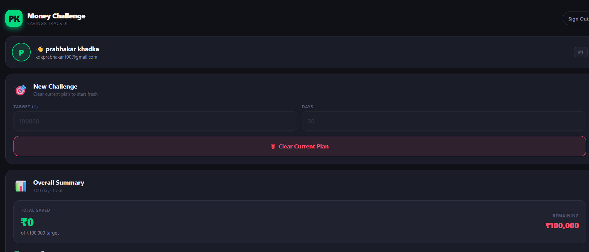
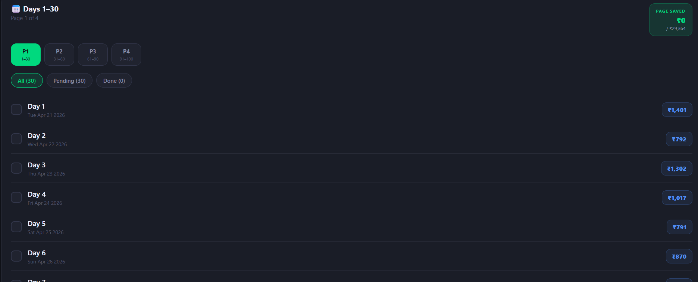

# 💰 Money Challenge App

A full-stack savings challenge application that helps users build disciplined saving habits through a personalized daily plan.

---

## 🚀 Live Demo

- 🌐 Frontend: https://savings-challenge-app--kl0wlw2l14.expo.app  
- ⚙️ Backend API: https://moneychallenge-backend.onrender.com  
- Live: https://savings-challenge-app.expo.app/

---

## 📌 Overview

Money Challenge App allows users to:

- 🔐 Register and securely log in  
- 🎯 Set a savings goal (amount + number of days)  
- 📅 Automatically generate a daily savings plan  
- ✅ Mark days as completed  
- 📊 Track total savings progress  
- ♻️ Reset and create a new plan  

---

## 🧱 Tech Stack

### Frontend
- Expo (React Native + Web)
- Expo Router

### Backend
- Node.js
- Express.js
- PostgreSQL
- JWT Authentication
- bcrypt

### Hosting
- Frontend → Expo Hosting  
- Backend → Render  
- Database → Render PostgreSQL  

---

## 📂 Project Structure

moneychallenge/
├── savings-challenge-app/   # Frontend (Expo)
└── savings-backend/         # Backend (Node + Express)

---

## ⚙️ Features

### 🔑 Authentication
- User registration
- Login with JWT
- Protected API routes

### 💡 Savings System
- Dynamic savings plan generation
- Weighted random distribution for daily amounts
- Accurate total matching target amount

### 📊 Progress Tracking
- Mark/unmark completed days
- Automatic total saved calculation
- Persistent data in PostgreSQL

### 🧹 Plan Management
- Prevent multiple active plans
- Clear existing plan
- Generate new plan anytime

---

## 🛠️ Getting Started (Local Setup)

### 1. Clone Repository

git clone https://github.com/kdkprabhakar100/moneychallenge.git  
cd moneychallenge  

---

## 🔧 Backend Setup

cd savings-backend  
npm install  

Create `.env` file:

JWT_SECRET=your_secret_key  
DATABASE_URL=your_postgres_connection  
NODE_ENV=production  

Run backend:

npm start  

Runs on:
http://localhost:5000  

---

## 💻 Frontend Setup

cd savings-challenge-app  
npm install  

Create `.env` file:

EXPO_PUBLIC_API_URL=https://moneychallenge-backend.onrender.com  

Run app:

npx expo start  

For web:

npx expo start --web  

---

## 🔌 API Endpoints

### Public

POST /register  
POST /login  
GET /  
GET /health  

### Protected (JWT Required)

GET /me  
POST /create-challenge  
GET /latest-challenge  
PATCH /challenge-day/:dayId/toggle  
DELETE /clear-challenge  

---

## 🗄️ Database Schema

### app_users
- id
- name
- email
- password

### savings_challenges
- id
- user_id
- target_amount
- start_date
- end_date
- total_saved

### challenge_days
- id
- challenge_id
- day_date
- amount
- completed

---

## 🚀 Deployment

### Backend (Render)
- Node Web Service
- Environment variables configured
- PostgreSQL database connected

### Frontend (Expo Hosting)

npx expo export --platform web  
eas deploy  

Production:

eas deploy --prod  

---

## 🔮 Future Improvements

- Charts & analytics  
- Challenge history  
- Notifications  
- Profile settings  
- Mobile app release  

---

## 👨‍💻 Author

Ashweeni Paudel  

---

## ⭐ Support

If you like this project:
- Star the repo  
- Fork it  
- Build on top of it  

## ui

